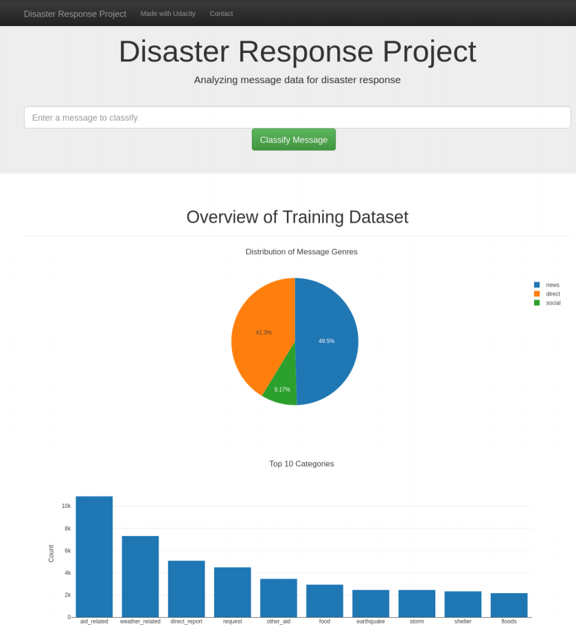

# Introduction
In this project, we aim at building an end-to-end machine learning application to classify the messages into 36 categories related to disaster. This is helpful to extract only disaster related from multiple media sources, so any appropriate disaster relief agency can be reached out for help.

# Project components
Project is comprised of components: `ETL pipeline`, `ML pipeline` and `Flass App`.

## Installation
To successfully run the project, below are list of dependencies need to be installed in the python environment:
* python >3.6
* sklearn==0.0
* nltk==3.5
* SQLAlchemy==1.3.22
* pandas==1.1.5
* numpy==1.19.4
* plotly==4.14.1
* Flask==1.1.2 
 
## ETL pipeline
* Perform Extract, Transform and Load data provided by Figure8 including `messages` and its corresponding `categories`.
* Target table will be stored in SQLite under table `disaster_response` 
* Run `python process_data.py messages.csv categories.csv disaster_response.db disaster_response` in `data` directory to execute the ETL pipeline
  
## ML pipeline
* Perform load data, build model, train, run cross validation for best param and export artifact model.
* Target output is `classifier.pkl` file which will be used later for prediction on Flask App.
* Run `python train_classifier.py ./../data/disaster_response.db classifier.pkl` in `models` directory to execute the ML pipeline

## Flask app
* Visualize the report of the categories, message genre data
* Classify input message from dashboard
* Run `python run.py` in `app` directory to execute the Flask application

    The dashboard looks as below:

    

# Licensing, Authors, Acknowledgement
Credits must be given to [Figure Eight](https://www.figure-eight.com) for the provided data.